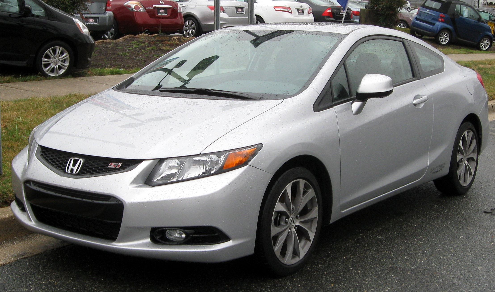
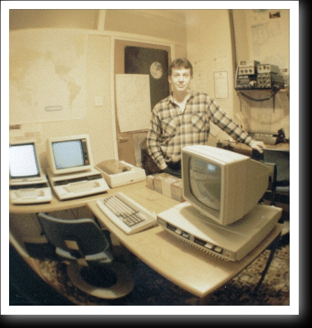
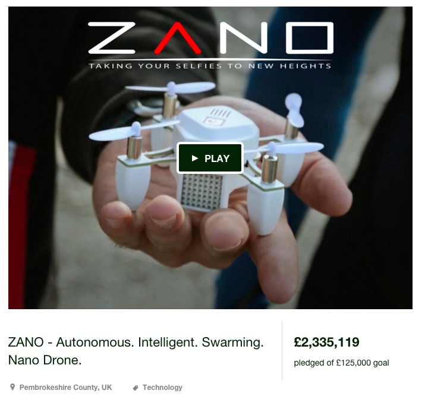
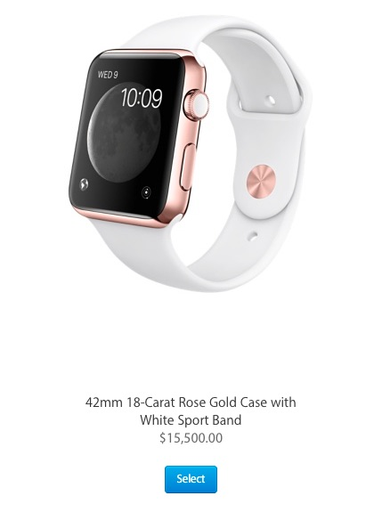
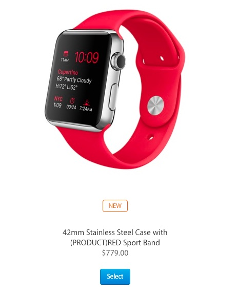

# What actually *is* value?
#### https://getjobber.com
#### @benzittlau
#### http://benzittlau.com
#### http://springlaunched.com
#### http://zittlau.ca
#### http://github.com/benzittlau

## Why is understanding value important?
In particular for engineers

## Our Job
An engineers role is to apply science and technology to create value for society

# Science and Technology
#### Create Value for Society

## My Goal
I won't attempt to answer the question today, but if I have made you think more deeply about value and how to create it I have been successful

## So what *is* value?
> a fair return or equivalent in goods, services, or money for something exchanged

> -- <cite>merriam-webster</cite>

Let's look at some examples related to cars

## Fixing up a car
> Suppose you own a beat-up old car. Instead of sitting on your butt next summer, you could spend the time restoring your car to pristine condition. In doing so you create wealth. The world is-- and you specifically are-- one pristine old car the richer. And not just in some metaphorical way. If you sell your car, you'll get more for it.

[How to make wealth - Paul Graham](http://paulgraham.com/wealth.html)

Note:
Apparently it is possible to create value by using time and effort

## Driving a car off the lot
On average a car loses 11% of it's value the minute it's driven off the lot

[How fast does my car lose value - Edmunds](http://www.edmunds.com/car-buying/how-fast-does-my-new-car-lose-value-infographic.html)

Note:
Apparently it is also possible to destroy value

## Apparently value is something that can be both created and destroyed
Let's call this positive value and negative value

## Does effort always correlate to resulting value?
Let's look at some other examples

### Peet's Utilities - The Infinitely profitable program
Circa 1986 and the TCP-2000

In a popular editor Wordstar, you had to know the path to a file in order to load it.  If you needed to find the file, you had to exit Wordstar and use dir, and then reload Wordstar form a floppy disk.

This was slow.

Peet Morris solved the problem.

[The infinitely profitable program](http://peetm.com/blog/?p=55)

### JMP 0100h
The program was GO.COM.  It was 0 bytes.  It worked as follows:

* the user exited WordStar
* the user ran DIR (or whatever else they needed) and at some future point would be ready to re-run Wordstar
* the user now 'loaded' and ran GO.COM
* the loader would load zero bytes of the GO.COM program off disk into the TPA - starting at address 0100h - and then jump to 0100h - to run the program it just loaded [GO.COM]!
* result - it simply re-ran whatever was in the TPA when the user last exited to DOS - instantly [WordStar in this example]!

### Analysis
The program was 0 bytes, and Pete sold it for &pound;5.

> I'd given them something useful and if nothing else, I charged them &pound;5 for an implementation of the idea!
> -- <cite>Pete Moris</cite>

## The Zano Drone
Autonomous. Intelligent. Swarming. Nano Drone

[How Zano Raised Millions on Kickstarter and Left Most Backers with Nothing](https://medium.com/kickstarter/how-zano-raised-millions-on-kickstarter-and-left-backers-with-nearly-nothing-85c0abe4a6cb#.oqhxqob5z)

### The Zano Drone - The numbers
Money Raised - ~$3.5 Million USD

Units Committed To - ~15,000

Money Spent on Materials - ~$2.2 Million USD

Units Shipped - ~600

Units Working Today - 0

>Torquing was left having paid for tens of thousands of propellers it could not use.

Note:
Money was spent on parts, but the parts ended up not working.  They went from having value to having no value in an instant.

### What happened?
>I have heard about enthusiasm, dedication and hard work, and endless late nights attempting to develop cutting-edge technologies and solve thorny problems. There were tales of teamwork, camaraderie, and community. But I found evidence of overconfidence, exaggeration, and obfuscation as well.

Note:
Despite significant investment and effort, the end result was 0 value.

## Does cost always correlate to value?
Let's look at some other examples

## Apple watch
Functionally equiavlent, but one has 15k more value.

## Presents/Sentiment
How does something that's used become more valuable than it was new?

## Wikipedia
Article count - 5,065,740

Registered editors - 27,344,404

Views Per Hour - 10,261,141

Monthly Unique Visitors -  500,000,000

Price - Free

## Encylopedia Brittanica
Articles - 40,000

Price - $1,400

Note:
Clearly there is a disconnect here between the price and the value

## Have I done my job?
If I've accomplished what I set out to do you now have more questions about value than you did 10 minutes ago.  Just in case, here's some more:

## Cigarette industry, does it create value?

## Does time have value?

## Does currency have value?

## Do bitcoin have value?

## Does education have value?

## How can you tell if you're creating value?
